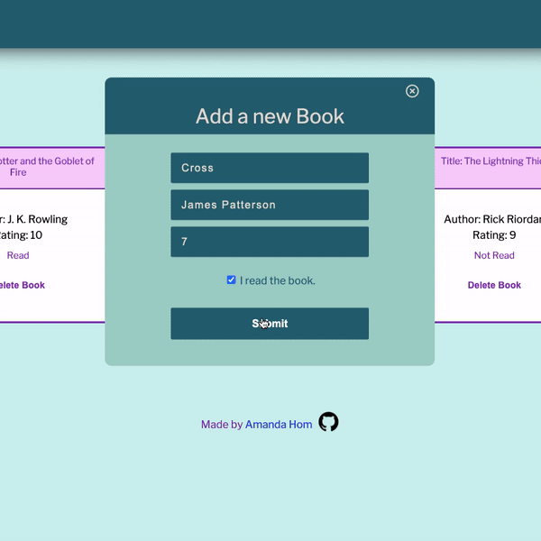

# Book Library

Allows users to add a new book to the Library.

# Technologies Used

- HTML
- CSS
- Javascript

# Features

- Add a book's title, author, rating, and a "read" status to the Library
- Change the "read" status or delete a book
- Utilizes localStorage to save books on user's browser
